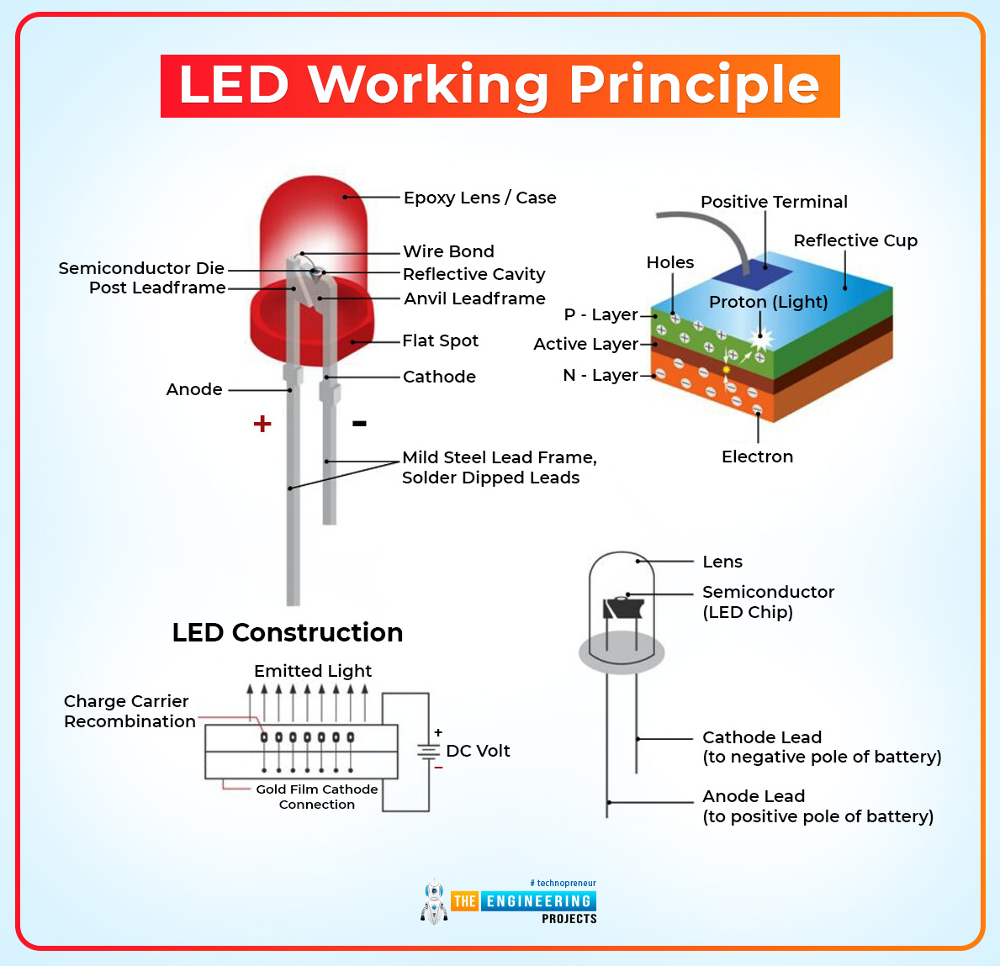

# Interfacing between Circuit board an RasberryPi computer
## GPIO Pins
> General Purpose I/O (40 pins)


GPIO pins have safety limit of $16mA$ of current.
- Else Hardware damaged (may cause fires, from heating)
- Voltage stability
- Power Suppy limitations

# EduKit 2
### Parts:
> 2 Large LED (Red, Blue)

```
{
    "voltageRange": "1.8V..3.3V",
    "CurrentLimit": "unknown",
    "Brightness": "unknown",
}
```
##### Reading resistors:
5-band: first 3 is sig digits, fourth is multiploer and fifth for tolerance

> 2 Resistors
- 5 band: Orange, Orange, Black, Black, Brown
$330 Hz$, 1(F)

Resistors help in reducing the current passed through the circuit.


